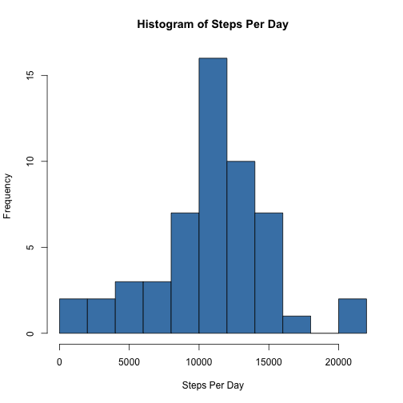
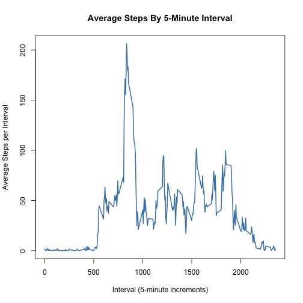
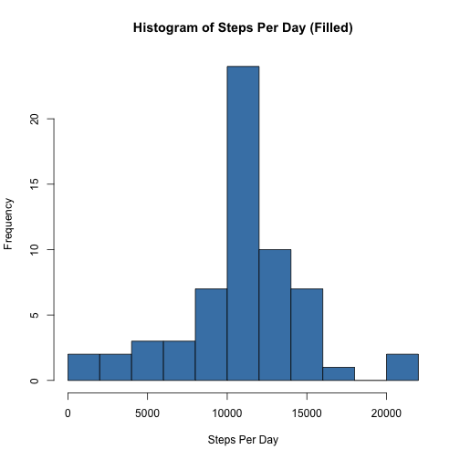
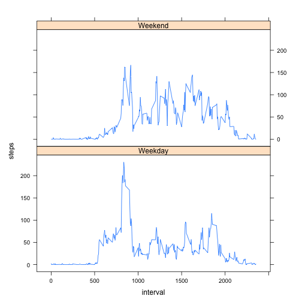

# Reproducible Research: Peer Assessment 1
========================================================

This is an R Markdown document that satifies the requirements of Peer 
Assessment 1 for the Reproducible Research Course offered on Coursera by 
Johns Hopkins University.

All R-code executed throughout this document will echo (ECHO=TRUE) to the HTML 
for the sake of clarity and to allow perr reviewers to evaluate the code 
without the risks inherent in running unknown code on their own machines.

## Loading the data

```r
## read the data into R from the working directory.  Assumes that .csv file
## is located in the current working directory
moveData <- read.csv("activity.csv")
```


## Preprocessing the data

```r
## Convert date field to date object
moveData$date <- as.Date(moveData$date, format = "%Y-%m-%d")
```


## What is mean total number of steps taken per day?

```r
## 1.Make a histogram of the total number of steps taken each day

stepsPerDay <- aggregate(steps ~ date, data = moveData, sum, na.rm = TRUE)
hist(stepsPerDay$steps, main = "Histogram of Steps Per Day", xlab = "Steps Per Day", 
    ylab = "Frequency", col = "steel blue", breaks = 10)
```

 

```r

## 2.Calculate and report the mean and median total number of steps taken per
## day

mean(stepsPerDay$steps)
```

```
## [1] 10766
```

```r

median(stepsPerDay$steps)
```

```
## [1] 10765
```


## What is the average daily activity pattern?

```r
## 1.Make a time series plot (i.e. type = 'l') of the 5-minute interval
## (x-axis) and the average number of steps taken, averaged across all days
## (y-axis)

meanStepsPerInterval <- aggregate(steps ~ interval, data = moveData, mean, na.rm = TRUE)
plot(meanStepsPerInterval, type = "l", xlab = "Interval (5-minute increments)", 
    ylab = "Average Steps per Interval", main = "Average Steps By 5-Minute Interval", 
    col = "steel blue", lwd = 2)
```

 

```r

## 2.Which 5-minute interval, on average across all the days in the dataset,
## contains the maximum number of steps?

meanStepsPerInterval[which.max(meanStepsPerInterval$steps), "interval"]
```

```
## [1] 835
```


## Imputing missing values

```r
## 1.Calculate and report the total number of missing values in the dataset
sum(is.na(moveData$steps))
```

```
## [1] 2304
```


Because the data are slightly skewed and there are a large number of missing 
values, the median was chosen as the best measure of centrality to use as 
a substitute for "NA"


```r
## 2.Devise a strategy for filling in all of the missing values in the
## dataset.  The strategy does not need to be sophisticated. For example, you
## could use the mean/median for that day, or the mean for that 5-minute
## interval, etc.  3.Create a new dataset that is equal to the original
## dataset but with the missing data filled in.

## Calulate median steps by time interval.
medianStepsPerInterval <- aggregate(steps ~ interval, data = moveData, mean, 
    na.rm = TRUE)

## Create new dataframe for editing by merging the original data and the
## median steps by interval data.
moveDataFilled <- merge(moveData, medianStepsPerInterval, by.x = "interval", 
    by.y = "interval", all = TRUE)

## Change 'NA' values to median values only if 'NA' value exists
moveDataFilled <- transform(moveDataFilled, steps.x = ifelse(is.na(steps.x), 
    steps.y, steps.x))

## subset altered data frame to only the first three columns and rename them
## to match the original data frame.
moveDataFilled <- subset(moveDataFilled[, c(1, 2, 3)])
names(moveDataFilled) <- c("interval", "steps", "date")

## 4.Make a histogram of the total number of steps taken each day and
## Calculate and report the mean and median total number of steps taken per
## day. Do these values differ from the estimates from the first part of the
## assignment? What is the impact of imputing missing data on the estimates
## of the total daily number of steps?

stepsPerDayFilled <- aggregate(steps ~ date, data = moveDataFilled, sum, na.rm = TRUE)
hist(stepsPerDayFilled$steps, main = "Histogram of Steps Per Day (Filled)", 
    xlab = "Steps Per Day", ylab = "Frequency", col = "steel blue", breaks = 10)
```

 

```r

## Calculate and report the mean and median total number of steps taken per
## day with missing values filled in with median values by time slice
mean(stepsPerDayFilled$steps)
```

```
## [1] 10766
```

```r

median(stepsPerDayFilled$steps)
```

```
## [1] 10766
```


There does is not a significant difference in either the mean or median values 
for the filled or unfilled data sets, respectively.  Some of the skewness of the
data, however, has been reduced (the mean and median are equal in the filled 
data).

Graphically, the central peak has grown higher (greater frequency) indicating 
that more central values are dominating the data set.

## Are there differences in activity patterns between weekdays and weekends?

```r
## 1.Create a new factor variable in the dataset with two levels - 'weekday'
## and 'weekend' indicating whether a given date is a weekday or weekend day.

## Create new column, and assign to it the day of the week
moveDataFilled$day <- weekdays(moveDataFilled$date)

## Create new column, and assign to it the day type from c('Weekday',
## 'Weekend')
moveDataFilled$dayType <- ifelse((moveDataFilled$day == "Saturday" | moveDataFilled$day == 
    "Sunday"), "Weekend", "Weekday")

## 2.Make a panel plot containing a time series plot (i.e. type = 'l') of the
## 5-minute interval (x-axis) and the average number of steps taken, averaged
## across all weekday days or weekend days (y-axis).

## load the lattice package for panel plots
require(lattice)

## Calculate the mean number of steps per interval
meanStepsPerIntervalFilled <- aggregate(steps ~ interval + dayType, data = moveDataFilled, 
    mean)
xyplot(steps ~ interval | factor(dayType), data = meanStepsPerIntervalFilled, 
    aspect = 1/2, type = "l")
```

 


Yes, there are differences.  Weekday activity seems to be concentrated mosting 
in the morning (before 1000); while weekend activity os more evenly spread 
thoughout the waking hours (about 0500 to 2000).
